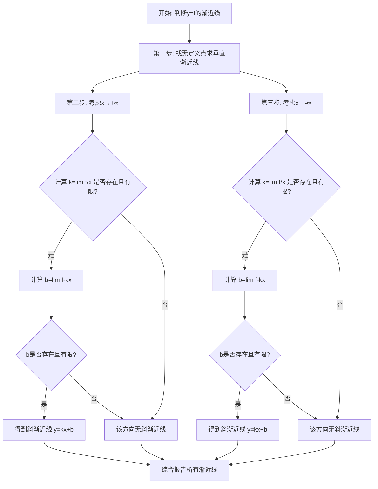

```mermaid
graph TD
    A[开始: 判断y=f的渐近线] --> B[第一步: 找无定义点求垂直渐近线];
    B --> C[第二步: 考虑x→+∞];
    B --> D[第三步: 考虑x→-∞];
    
    C --> E{计算 k=lim f/x 是否存在且有限?};
    E -->|是| F[计算 b=lim f-kx];
    E -->|否| G[该方向无斜渐近线];
    F --> H{b是否存在且有限?};
    H -->|是| I[得到斜渐近线 y=kx+b];
    H -->|否| G;
    
    D --> J{计算 k=lim f/x 是否存在且有限?};
    J -->|是| K[计算 b=lim f-kx];
    J -->|否| L[该方向无斜渐近线];
    K --> M{b是否存在且有限?};
    M -->|是| N[得到斜渐近线 y=kx+b];
    M -->|否| L;
    
    I --> O[综合报告所有渐近线];
    G --> O;
    N --> O;
    L --> O;
```